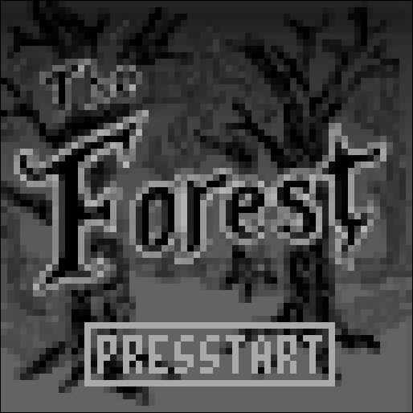
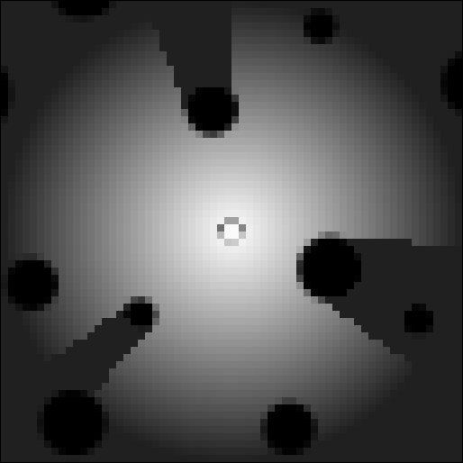
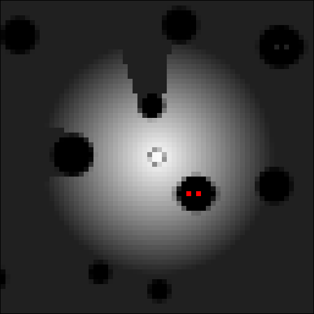
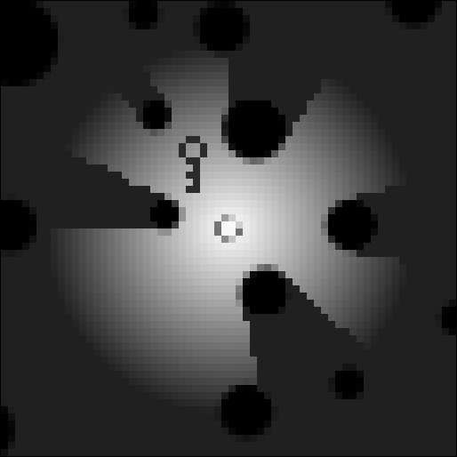
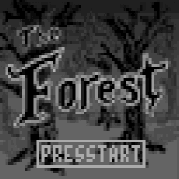

# The Forest

Q&D entry for the 64x64 pixel Low Rez Jam 2016: https://itch.io/jam/lowrezjam2016

"The Forest": https://itch.io/jam/lowrezjam2016/rate/61426

Nothing fancy, just a horror pac-man game.

Live version: http://kacmarcik.com/gamejam64x64/game.html

## Description

Simple game where you need to find the key hidden in the dark forest. Your life force (and your light) is slowly draining and the shadows are chasing you. Light crystals (if you can find them) provide a brief respite from the dark, but they are limited in number.

Arrow keys or WASD to move.

Space or Enter to restart game.

<table><tr><td>

</td><td>

</td><td>

</td></tr></table>

